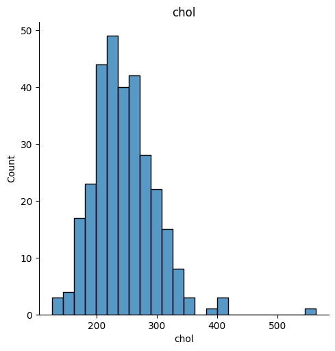

# Laporan Proyek Machine Learning
### Nama : Annisa Mustika Anggraeni
### Nim : 211351020
### Kelas : TIF Pagi A

## Domain Proyek
Dalam proyek ini bertujuan untuk melakukan analisis mendalam terhadap dataset terkait serangan jantung serta membangun model prediksi untuk mengidentifikasi faktor-faktor risiko dan memperkirakan kemungkinan serangan jantung pada seseorang. Data yang digunakan mencakup berbagai parameter kesehatan dan informasi klinis yang dapat memberikan wawasan yang berharga terkait prediksi serangan jantung.

## Business Understanding
Penyakit kardiovaskular, terutama serangan jantung, tetap menjadi salah satu penyebab utama kematian global. Dalam konteks ini, proyek analisis dan prediksi serangan jantung menjadi krusial untuk mendukung upaya pencegahan, pengelolaan risiko kesehatan, dan peningkatan kualitas hidup. Data yang melibatkan informasi kesehatan pasien dapat memberikan wawasan mendalam tentang faktor-faktor yang berkontribusi terhadap serangan jantung, memungkinkan pengembangan strategi pencegahan yang lebih efektif.

Bagian laporan ini mencakup :

### Problem Statements
- Bagaimana kita dapat mengidentifikasi dan memahami faktor risiko utama yang berkaitan dengan serangan jantung berdasarkan data kesehatan yang tersedia.
- Bagaimana kita dapat mengembangkan model prediksi yang akurat untuk menilai risiko serangan jantung pada tingkat individu berdasarkan data pasien?

### Goals
- Mengidentifikasi dan menganalisis faktor risiko utama yang berhubungan dengan serangan jantung berdasarkan dataset yang tersedia.
- Mengembangkan model prediksi serangan jantung yang dapat memberikan informasi risiko secara akurat berdasarkan data kesehatan pasien.
- Mendukung tenaga medis dalam mengelola kesehatan pasien dengan memberikan informasi yang berguna untuk penilaian risiko dan perencanaan perawatan.

### Solution Statements
1. Melakukan analisis mendalam terhadap dataset untuk mengidentifikasi dan menggali hubungan antara berbagai faktor risiko, seperti tekanan darah, kadar gula darah, dan tingkat kolesterol.
2. Membangun model prediksi serangan jantung menggunakan teknik machine learning dengan menggunakan model decision tree untuk memperoleh hasil yang akurat.

## Data Understanding
Data ini menggunakan dataset yang berasal dari kaggle. Dataset ini berisi informasi kesehatan individu, termasuk data demografis, riwayat medis, dan faktor-faktor risiko yang berkaitan dengan serangan jantung.Variabel-variabel utama yang mungkin termasuk adalah usia, jenis kelamin, angina, kadar kolesterol, adanya diabetes, jenis nyeri dada, hasil elektrokardiografi. Terdiri dari 314 baris dan 14 kolom, yang mencakup berbagai varibel yang berkaitan dengan penyakit serangan jantung.

[Heart Attack Analysis & Prediction Dataset](https://www.kaggle.com/datasets/rashikrahmanpritom/heart-attack-analysis-prediction-dataset)

### Variabel - variabel pada Heart Attack Analysis & Prediction Dataset sebagai berikut :
- Age : usia pasien
- Sex : jenis kelamin pasien
- exang: angina yang diinduksi oleh olahraga (1 = ya; 0 = tidak)
- ca: jumlah pembuluh darah utama (0-3)
- cp: jenis nyeri dada 
   - Nilai 1: angina tipikal
   - Nilai 2: angina atipikal
   - Nilai 3: nyeri non-angina
   - Nilai 4: tanpa gejala
trtbps : tekanan darah istirahat (dalam mmHg)
- kol : kolestrol dalam mg/dl yang diambil melalui sensor BMI
- fbs : (gula darah puasa > 120 mg/dl) (1 = benar; 0 = salah)
- rest_ecg : hasil elektrokardiografi saat istirahat
    - Nilai 0: normal
    - Nilai 1: memiliki kelainan gelombang ST-T (inversi gelombang T dan atau elevasi atau depresi ST > 0,05 mV)
    - Nilai 2: menunjukkan hipertrofi ventrikel kiri yang mungkin atau pasti berdasarkan kriteria Estes
- thalach : detak jantung maksimum yang dicapai
- target : 0 = kemungkinan serangan jantung lebih kecil, 1 = kemungkinan serangan jantung lebih besar.

## Data Preparation
### Data Collection
Untuk data collection ini, saya menggunakan dataset dengan judul Heart Attack Analysis & Prediction. Dataset tersebut didapatkan dari website kaggle.

## Data Discovery and Profiling
Disini saya menggunakan Teknik Decision Tree dan EDA.

Pertama-tama kita disini akan menggunakan google colab untuk mengerjakannya maka kita akan menghubungkan google colab dengan kaggle. Kita harus import file lalu mengupload token kaggle kita agar nanti bisa mendownload sebuah dataset dari kaggle melalui google colab.
```python
from google.colab import files
files.upload()
```
Selanjutnya setelah kita menggupload file kaggle kita, maka kita akan lanjut dengan membuat sebuah folder untuk menyimpan file kaggle.json yang sudah diupload tadi.
```python
!mkdir -p ~/.kaggle
!cp kaggle.json ~/.kaggle/
!chmod 600 ~/.kaggle/kaggle.json
!ls ~/.kaggle
```
Tahap selanjutnya kita akan memanggil url dataset yang sudah ada di website kaggle untuk didownload ke google colab.
```python
!kaggle datasets download -d rashikrahmanpritom/heart-attack-analysis-prediction-dataset
```
Nah, jika sudah berhasil selanjutnya kita akan ekstrak dataset yang sudah kita download.
```python
!mkdir heart-attack-analysis-prediction-dataset
!unzip heart-attack-analysis-prediction-dataset.zip -d heart-attack-analysis-prediction-dataset
!ls heart-attack-analysis-prediction-dataset
```
Jika sudah mari kita lanjutkan kembali, karena disini kita akan menggunakan teknik Decision Tree dan EDA. Maka dari itu kita harus mengimport semua library yang dibutuhkan.
```python
import pandas as pd
import numpy as np
import matplotlib.pyplot as plt
import seaborn as sns
from sklearn import tree
from sklearn.model_selection import train_test_split
from sklearn.metrics import accuracy_score, confusion_matrix, classification_report
from sklearn.tree import DecisionTreeClassifier
```
Lalu kita panggil dataset file csv yang telah diekstrak pada sebuah variable.
```python
df = pd.read_csv('/content/heart-attack-analysis-prediction-dataset/heart.csv')
```
Setelah ini mari kita lihat dataset kita terlebih dahulu.
```python
df.sample()
```
Lalu kita juga bisa melihat berapa baris dan kolom yang ada di dataset kita.
```python
df.shape
```
Selanjutnya untuk melihat mengenai type data dari masing-masing kolom kita bisa menggunakan property info.
```python
df.info()
```
Setelah itu kita akan mengecek detail informasi dari dataset ini.
```python
df.describe()
```
Lalu kita juga akan meriksa apakah dataset tersebut terdapat baris yang kosong atau null.
```python
df.isnull().sum()
```
Kita juga bisa melihat melalui gambar apakah dataset tersebut terdapat baris yang kosong atau null dengan menggunakan seaborn.
```python
sns.heatmap(df.isnull())
```

Nah,kita bisa lihat hasilnya cukup aman.

Mari kita lanjutkan, setelah itu mari kita gambarkan visualisasi heatmap untuk melihat seaborn data pada dataset.
```python
plt.figure(figsize=(10,8))
sns.heatmap(df.corr(),annot=True,cmap='Blues')
```

Lalu mari kita tampilkan grafik frekuensi serangan jantung berdasarkan usia.
```python
pd.crosstab(df.age,df.output).plot(kind="bar",figsize=(20,6))
plt.title('Grafik frekuensi Serangan jantung berdasarkan usia')
plt.xlabel('Usia')
plt.ylabel('Frekuensi')
plt.savefig('SeranganJantungDanUmur.png')
plt.show()
```

Lalu kita tampilkan jumlah cp atau jenis nyeri dada.
```python
sns.histplot(df,x = df['cp'],bins = 10,)
```

Lalu kita akan menampilkan grafik trtbps (jumlah tekanan darah istirahat (dalam mmHg))
```python
sns.displot(data=df['trtbps'])
plt.xlabel('trtbps')
plt.ylabel('Count')
plt.title('trtbps')
```

Selanjutnya kita akan menampilkan grafik chol (kolestrol dalam mg/dl yang diambil melalui sensor BMI
).
```python
sns.displot(data=df['chol'])
plt.xlabel('chol')
plt.ylabel('Count')
plt.title('chol')
```
Lanjut, kita akan menampilkan grafik dari thalach (detak jantung maksimum yang dicapai).
```python
sns.displot(data=df['thalachh'])
plt.xlabel('thalachh')
plt.ylabel('Count')
plt.title('thalachh')
```

Selanjutkan kita akan menampilkan plot dari orang yang terkena serangan jantung dan yang tidak terkena serangan jantung.
```python
plt.scatter(x=df.age[df.output==1], y=df.thalachh[(df.output==1)], c="red")
plt.scatter(x=df.age[df.output==0], y=df.thalachh[(df.output==0)])
plt.legend(["Terkena Serangan Jantung", "Tidak Terkena Serangan Jantung"])
plt.xlabel("Usia")
plt.show()
```

Satu lagi kita akan menampilkan subplot dari oldpeal,thalach,chol, dan age.
```python
plt.figure(figsize=(15, 8))

# Subplot 1:
plt.subplot(2, 2, 1)
plt.title("Oldpeak")
sns.barplot(x='output', y='oldpeak', hue='sex', data=df, palette='Set2')
plt.xlabel('Output')
plt.ylabel('Oldpeak')

# Subplot 2:
plt.subplot(2, 2, 2)
plt.title("Thalachh")
sns.barplot(x='output', y='thalachh', hue='sex', data=df, palette='Set2')
plt.xlabel('Output')
plt.ylabel('Thalachh')

# Subplot 3:
plt.subplot(2, 2, 3)
plt.title("Chol")
sns.barplot(x='output', y='chol', hue='sex', data=df, palette='Set2')
plt.xlabel('Output')
plt.ylabel('Chol')

# Subplot 4:
plt.subplot(2, 2, 4)
plt.title("Age")
sns.barplot(x='output', y='age', hue='sex', data=df, palette='Set2')
plt.xlabel('Output')
plt.ylabel('Age')

plt.tight_layout()

plt.show()
``` 


Lanjut, sekarang kita akan mencoba untuk memisahkan antara fitur dan labelnya.
```python
ind_col = [col for col in df.columns if col !='output']
dep_col = 'output'
```
Lalu kita coba untuk menentukan labelnya.
```python
df[dep_col].value_counts()
```
Setelah itu kita akan mengindentifikasi data fitur dan labelnya.
```python
x =df[ind_col] #Feature
y = df[dep_col] #Label
```
## Modeling
Sekarang kita mencoba untuk mentraining dan testing datasetnya.
```python
from sklearn.model_selection import train_test_split

x_train, x_test, y_train, y_test = train_test_split(x, y, test_size=0.40, random_state=30)
```
Selanjutnya kita akan membuat model untuk decision tree nya. Dan kita juga akan mengetahui seperti nilai akurasi  data testing,data training,confusion matrik dan classification report.
```python
from sklearn.metrics import accuracy_score, confusion_matrix, classification_report
from sklearn.tree import DecisionTreeClassifier

# Assuming you have defined x_train, y_train, x_test, and y_test

dtc = DecisionTreeClassifier(
    ccp_alpha=0.0, class_weight=None, criterion='entropy',
    max_depth=4, max_features=None, max_leaf_nodes=None,
    min_impurity_decrease=0.0, min_samples_leaf=1,
    min_samples_split=2, min_weight_fraction_leaf=0.0,
    random_state=42, splitter='best'
)

model = dtc.fit(x_train, y_train)

dtc_acc = accuracy_score(y_test, dtc.predict(x_test))

print(f"Akurasi data training = {accuracy_score(y_train, dtc.predict(x_train))}")
print(f"Akurasi data testing = {dtc_acc} \n")

print(f"Confusion matrix : \n {confusion_matrix(y_test, dtc.predict(x_test))}\n")
confusion = confusion_matrix(y_test, dtc.predict(x_test))
tn, fp, fn, tp = confusion.ravel()
print(f"Classification report : \n {classification_report(y_test, dtc.predict(x_test))}")
```


Lalu kita akan simulasikan data dari dataset untuk mengetahui apakah sama gak hasilnya dengan labelnya.
```python
input_data = (29,	1, 3,	31,	64,	1, 0,	49,	0, 2.3,	0, 0,	1)

input_data_as_numpy_array = np.array(input_data)

input_data_reshape = input_data_as_numpy_array.reshape(1,-1)

prediction = model.predict(input_data_reshape)
print(prediction)

if (prediction[0]==1):
  print ('Pasien terkena serangan jantung')
else:
  print ('Pasien tidak terkena serangan jantung')
```
Setelah kita mengetahui jika hasilnya sama dengan hasil labelnya, mari kita lanjutkan kembali.
Nah disini kita akan membuat visualisasi pohon keputusan.
```python
from sklearn import tree
import matplotlib.pyplot as plt

plt.figure(figsize=(25, 20))
tree.plot_tree(
    model,
    feature_names=ind_col,
    class_names=['tidak terkena serangan jantung', 'terkena serangan jantung'],
    filled=True
)
plt.show()
```

Nah kita berhasil memunculkan pohon keputusannya maka disini kita akan membuat menyimpan model dengan pickle.
```python
import pickle
filename = 'heart.sav'
pickle.dump(model,open(filename,'wb'))
```
Proses modeling telah selesai.

## Evaluasi
Pada evaluasi ini, saya menggunakan metode classification report yang dimana 
Classification report adalah sebuah laporan yang menyediakan berbagai metrik evaluasi kinerja model klasifikasi pada tugas klasifikasi. Dalam konteks pembelajaran mesin dan pengenalan pola, tugas klasifikasi melibatkan pengelompokkan data ke dalam kategori atau kelas yang telah ditentukan.

Beberapa metrik yang umumnya termasuk dalam classification report antara lain:

1. **Presisi (Precision):** Sebuah metrik yang mengukur seberapa tepat model dalam mengidentifikasi instans positif. Rumusnya adalah jumlah true positive dibagi dengan jumlah true positive dan false positive.

   

2. **Recall (Sensitivitas atau True Positive Rate):** Merupakan metrik yang mengukur sejauh mana model mampu mengidentifikasi semua instance positif yang sebenarnya. Rumusnya adalah jumlah true positive dibagi dengan jumlah true positive dan false negative.

   

3. **F1-Score:** Merupakan harmonic mean dari presisi dan recall. Ini memberikan keseimbangan antara presisi dan recall. Rumusnya adalah:

   

4. **Support:** Jumlah instance dalam setiap kelas.

5. **Akurasi (Accuracy):** Mengukur seberapa tepat model secara keseluruhan. Rumusnya adalah jumlah instance yang diklasifikasikan dengan benar dibagi dengan total instance.

   

Classification report membantu para praktisi dan peneliti untuk mendapatkan pemahaman yang lebih komprehensif tentang kinerja model klasifikasi mereka, terutama ketika terlibat dalam tugas klasifikasi dengan lebih dari dua kelas. Report ini biasanya dihasilkan setelah model klasifikasi dievaluasi terhadap kumpulan data uji atau validasi.


## Deployment

https://appheartattack-decisiontree.streamlit.app/


